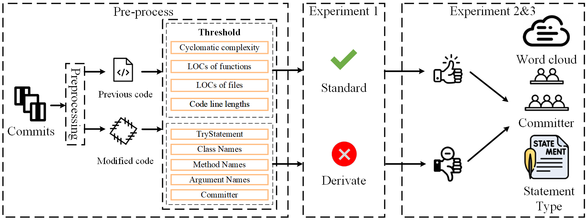

# `Evolving Code Cleanliness (ECC): A Tools`
<div align="center">

## **Evolving Trends in Cleanliness of Open Source Projects**

</div>

<p align="center">
    <a target="_blank" href="https://arxiv.org/abs"></a>
    <a target="_blank" href="https://huggingface.co/datasets/vincent20000/ECC-Dataset"></a>
</p>

<p align="center">
    <a href="#about">🤔 About</a> •
    <a href="#-getting-started">🚀 Getting Started</a> •
    <a href="#datasets">🤗 Datasets</a> •
    <a href="#-citation">📝 Citation</a>
</p>

> [!NOTE]
>
> [02-03-2026] 🔥 We release the first version of ECC and datasets.

**Contact:** If you have any inquiries or want to raise an issue, please feel free to contact:
- Vincent Yang at [wenjiey012@gmail.com](mailto:wenjiey012@gmail.com).

## About

<div align="center">

In this paper, we selected 30 projects based on their star count and commit activity for an
observational analysis of open-source projects from different communities. Our observational
analysis focuses on statistically examining code modifications, contributor behaviors, and changes in statement types to reveal patterns in code cleanliness evolution. 



_Overview of ECC workflow (see [Section II of our paper](https://arxiv.org/abs/2403.09032) for more details)._
</div>

> Our investigation addresses the following research questions:
> 
> RQ-1. Do open-source projects consistently adapt to cleaner modifications, and which met-
rics are predominantly emphasized by maintainers during the upkeep of these projects?
>
> This question explores the adherence of open-source project code to clean code standards, focus-
ing on eight perspectives: cyclomatic complexity (MethodCircles), LOCs in functions (Method-
Rows), LOCs in files (FileRows), code line lengths (LineChars), number of try-catch statements
(TryCatchNums), and the naming of classes, methods, and parameters.
> 
> RQ-2. To what degree are project maintainers committed to upholding clean code princi-
ples? Additionally, which specific categories of code modifications affect the code cleanli-
ness and necessitate particular scrutiny?
> 
> We categorize standard and non-standard modifica-
tions into positive and negative changes for this question, examining commit information and
generating word clouds.
> RQ-3. How significantly do alterations in code statements affect overall code cleanliness
when striving to write clean code? Moreover, regarding different metrics used to measure
clean code, which types of statement-level changes should be given priority for careful
consideration and possible revision?
> 
> In this question, we use the ASTs to analyze statement types and guide developers in making effective code modifications.
Our work features two main contributions: `ECC` and `ECC-Dataset`, a code repo and dataset for evolving trends in cleanliness of Open Source Projects.

The primary contributions of this work encompass:

* ✨ Conducting the first large-scale empirical study to assess evolving trends of open-source projects
from the code cleanliness perspective. Our analysis of the open-source projects from Apache,
Google, and Spring, involving 84,268,300 lines, 4,356,940 functions, and 197,461 file pairs, revealed
that most of the code within these projects has changed within standard limits, aligning with
the clean code standard.
* ✨ Through an examination of committer information related to positive and negative code changes,
we discovered a higher frequency of positive changes during manual code reviews compared to
automatic additions to the codebase, highlighting the significant role of human developers in
code review responsibilities. 
* ✨ Our analysis of the word clouds from code changes shows that refactoring is key to improving
code cleanliness, aligning with principles proposed by Martin. However, not all contributors’
refactoring efforts effectively align with clean code standards. Common terms like "support," "im-
prove," and "enhance" often appear in commit messages but can sometimes introduce complexity,
misaligning with clean code goals.
* ✨ Our analysis results guide the targeted code review by highlighting the different degrees of
emphasis on modified statement types within each referenced indicator of clean code.

`ECC-Dataset`: Given that Google, Apache, and Spring-projects have been widely
referenced in previous studies, our focus lies on open-source projects from these three
communities. For project selection, we utilize GitHub’s advanced search 15 to filter projects by
language and organization name. From this pool, we further narrow the selection based on the
number of stars and commits in recent years, as shown in figure of workflow, ultimately selecting the top 10
projects from each organization. These well-known open-source projects have also been widely
studied in the literature. Our analysis covers code master commits made between
January 1, 2022, and December 15, 2024. We utilized ASTs to establish mapping relationships
between files and functions before and after code changes. This resulted in a dataset comprising
197,461 pairs of files (before vs. after), 4,356,94 functions, and 84,268,300 code lines.

## 🚀 Getting Started 

This project provides an automated pipeline for **large-scale mining of GitHub repositories** and **quantitative analysis of code evolution**, including changes in function parameters, cyclomatic complexity, lines of code, and character-level metrics across commits.

The tool is designed for **empirical software engineering research** and supports **batch processing of multiple repositories**.

---

### 1. Prerequisites

#### 1.1 GitHub Personal Access Token (Required)

The GitHub REST API enforces strict rate limits.
All data collection in this project **requires authentication via a GitHub Personal Access Token (PAT)**.

##### Token Generation Procedure

1. Navigate to
   [https://github.com/settings/tokens](https://github.com/settings/tokens)
2. Generate a new token (Fine-grained or Classic).
3. Grant at least:

   * `repo` (read-only access is sufficient for public repositories)
4. Copy the token securely (the token is shown only once).

⚠️ **Security Note**
The token **must not be hard-coded** in source files or committed to version control.

---

#### 1.2 Token Configuration

##### Write Tokens to Search.py (28 lines)

```bash
TOKENS = [*************************************888] 
```
---

### 2. Project Structure

```text
.
├─ data_crawler
├── search.py              # Main pipeline (data collection)
├── auto_plus.sh

├─ JavaPatchParser
├── Circle
├─── Src
├──── main
├──── test
├───── java
├───── EntranceTest.java (Main)
```

---

### 3. Core Workflow

The analysis pipeline consists of the following stages:

```text
Commit Discovery  →  File Download  →  Code Parsing  →  Metric Analysis
```

Corresponding functions:

| Stage                      | Function      |
| -------------------------- | ------------- |
| Commit retrieval           | `search()`    |
| File download              | `download()`  |
| Code analysis              | `entrance.calcAttributes`  |
| Statistical summary        | `entrance.JavaPatchParser`  |
| Threshold-based evaluation | `entrance.print(Metrics)+analyse(Metrics)` |

---

### 4. Running the Python Pipeline (`search.py`)

#### 4.1 Command-Line Arguments

| Argument           | Description                             |
| ------------------ | --------------------------------------- |
| `-r, --repository` | Target GitHub repository (`owner/repo`) |
| `-s, --start_time` | Start date (`YYYY-MM-DD`)               |
| `-e, --end_time`   | End date (`YYYY-MM-DD`)                 |
| `-sf`              | Enable commit search                    |
| `-df`              | Enable file download                    |
| `-af`              | Enable analysis                         |
| `-suf`             | Enable summary statistics               |
| `-tf`              | Enable threshold-based analysis         |

---

#### 4.2 Example: Single Repository Analysis

##### Step 1: Retrieve Commit Metadata

```bash
python search.py \
  -r apache/dubbo \
  -s 2022-01-01 \
  -e 2024-12-15 \
  -sf 1
```

##### Step 2: Download Modified Files

```bash
python search.py \
  -r apache/dubbo \
  -df 1
```

##### Step 3: Analyze Code Evolution

```bash
python search.py \
  -r apache/dubbo \
  -af 1
```

##### Step 4: Aggregate Results

```bash
python search.py \
  -r apache/dubbo \
  -suf 1
```

---

### 5. Batch Execution Using Shell Script

The provided shell script enables **automated batch processing of multiple repositories** using `screen` sessions and timeout monitoring.

---

#### 5.1 Configuring Target Repositories

Edit the repository list in the shell script:

```bash
PARAM_LIST=(
  "spring-projects/spring-boot"
  "spring-projects/spring-framework"
  "spring-projects/spring-security"
  "spring-projects/spring-ai"
)
```

---

#### 5.2 Environment Configuration

Specify the Conda environment:

```bash
CONDA_ENV="ifcap"
```

Ensure the environment includes:

* Python ≥ 3.8
* `requests`
* `pymongo`
* `py4j`

---

#### 5.3 Running Batch Analysis

```bash
bash auto_plus.sh
```

The script will:

1. Launch background `screen` sessions
2. Execute commit search (`-sf 1`)
3. Execute file download (`-df 1`)
4. Monitor HTTP activity
5. Restart stalled tasks automatically

---

### 6. Data Storage (MongoDB)

All intermediate and final results are stored in MongoDB:

```python
commit_collection = get_collection("github_commit_2022")
```

The database connection must be configured in `connections.py`, e.g.:

```python
MongoClient("mongodb://localhost:27017/")
```

### 6. Data Analysis

```Java
    @Test
    public void test_calcAttributes() throws IOException {
      entrance.calcAttributes(); // compute all metrics
    }
```

### 7. Summary

```Java
    @Test
    public void test_calcSummary() throws IOException {
      entrance.calcSummary(); // summary
    }
```

### 8. Data Analysis with threshold

```Java
   @Test
   public void test_analyseMethodCircles() throws IOException {
     entrance.printMethodCircles(10); 
     entrance.analyseMethodCircles(10);
   }
```
---

## Datasets
- 🤗 **ECC-dataset**: [https://huggingface.co/datasets/vincent20000/ECC-Dataset](https://huggingface.co/datasets/vincent20000/ECC-Dataset)

## 📝 Citation
```
```